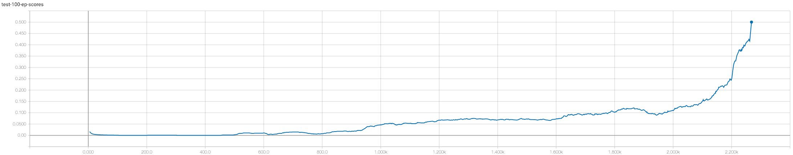
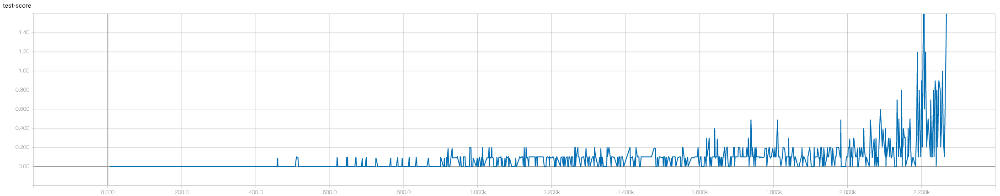

# Report for the Collaboration and Competition project

## Implementation
In this project an algorithm is trained to make 2 agents cooperate in such a way that they hit a ball over the net to
the other agent without dropping the ball.
The Unity environment has an observation space of 24 parameters (3 stacked frames of 8 vector observation parameters
for one agent and the ball) per agent. The action space has a size of 2 per agent, with values ranging from -1 to 1.

Reward structure (per agent):
- ball hit: +0.1
- ball dropped: -0.01
Episode score (both agents): max over score of 2 agents per episode.
The environment is considered solved when the average score is > 0.5 over 100 episodes.

## Algorithm
The used algorithm is a MultiAgent Deep Deterministic Policy Gradient (MADDPG, for the original article see
[here](https://arxiv.org/pdf/1706.02275.pdf). This project contains a modified version of the
Udacity DDPG pendulum implementation (as can be found
[here](https://github.com/udacity/deep-reinforcement-learning/tree/master/ddpg-pendulum) and the Continuous Control project (as can be found
[here](https://github.com/theune32/drlnd-continous).

After a number of trainings the following hyperparameters were used for the final run:

|Hyperparameter|Value|
|--------------|:----|
|BUFFER_SIZE|1e5|
|BATCH_SIZE|128|
|GAMMA|0.99|
|TAU|5e-3|
|LR_ACTOR|1e-4|
|LR_CRITIC|3e-4|
|WEIGHT_DECAY|0|

The implementation contains 2 models, Actor and Critic. Both with a 3 layer model with Relu activation in the first 2
layers. They both have 250 nodes on the first layer and 175 on the second layer. Differences between the 2 models:
- Actor has Tanh activation on the last layer.
- Critic has Relu activation on the last layer
- Critic the action input added in the second layer.
- Critic output nodes are equal to the amount of Actors (2 in this case)

## Results
For this particular run the environment was solved in 2269 episodes.

The mean score per episode diagram shows that agents are slowly learning from 500 episodes onward and there some clear
"jumps" in performance for the agent, noticeably around 500, 900, 1600 and 2200.

## Future work
There are number of clear improvements to be made, for this case (and some other specific cases) the algorithm could be
setup in such a way that also the agents learns from all experiences. Other improvements would be looking into
curriculum training (which is supported by Unity, see
[here](https://blogs.unity3d.com/2017/12/08/introducing-ml-agents-v0-2-curriculum-learning-new-environments-and-more/)).
This way the agents could be trained faster to first move around or towards the ball before focusing more on
cooperation. Also considering the previous project, a setup with multiple pairs could speedup training overall.